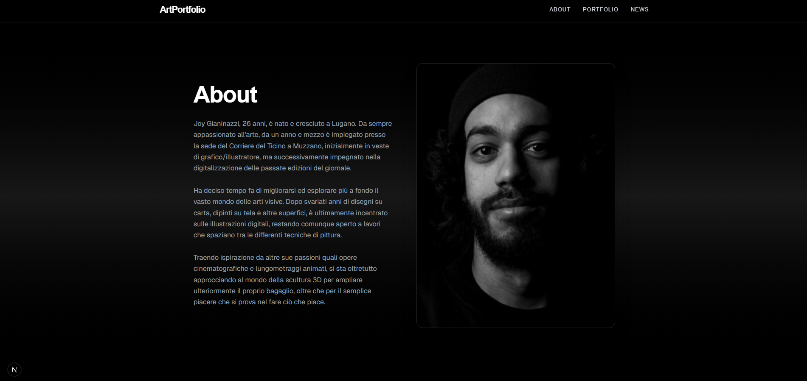
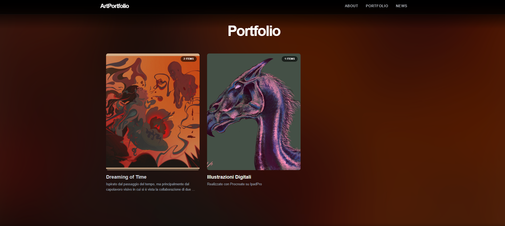
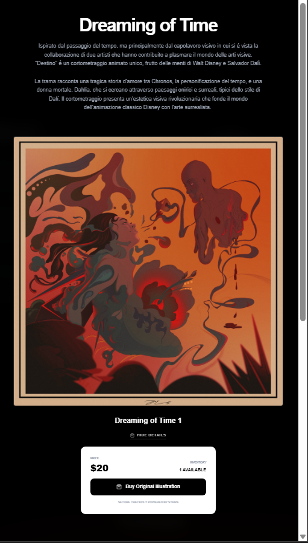
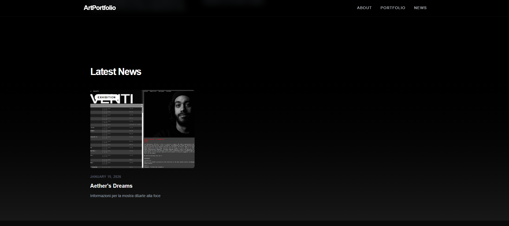
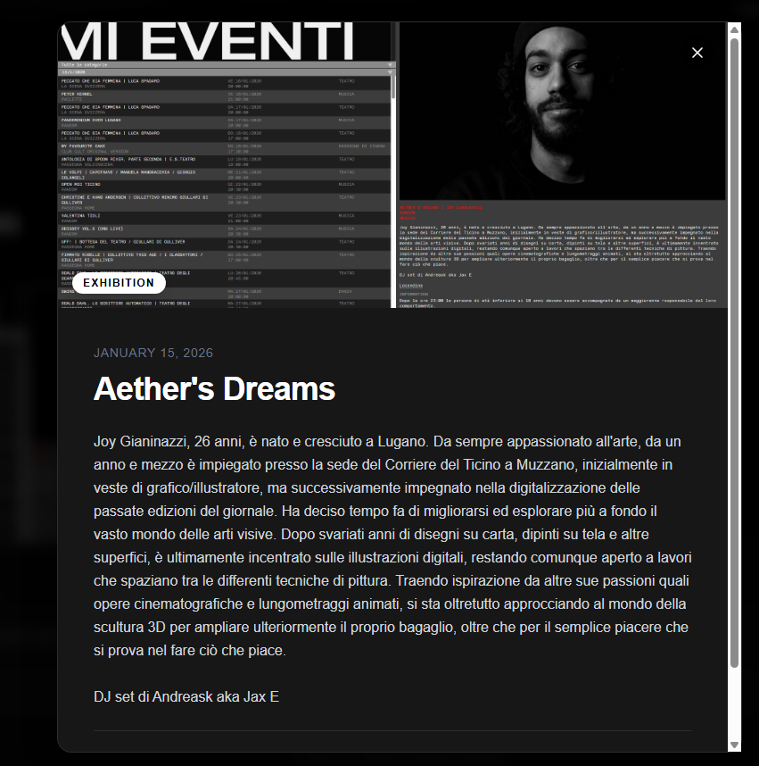

# 🎨 Art Portfolio & CMS

A high-performance, dark-themed art portfolio website featuring a custom Content Management System (CMS), integrated directly with Supabase and Cloudinary. This application serves as a comprehensive platform for artists to showcase their work, manage sales through limited drops, and publish news updates.

## 🖼️ Demo Gallery

<div align="center">

  
_Landing Hero_

  
_About Section_

  
_Portfolio - Collections_

  
_Portfolio - Items_

  
_News - Preview_

  
_News - Modal_

</div>

## ⚡ Technology Stack

- **Framework**: [Next.js 16](https://nextjs.org/) (App Router, Server Actions, TypeScript)
- **Styling**: [Tailwind CSS 4](https://tailwindcss.com/)
- **Database**: [Supabase](https://supabase.com/) (PostgreSQL)
- **Image Hosting**: [Cloudinary](https://cloudinary.com/) (Upload Widget & Management API)
- **Icons**: [Lucide React](https://lucide.dev/)
- **Animations**: [Framer Motion](https://www.framer.com/motion/)
- **Monitoring**: [Sentry](https://sentry.io/) (Error tracking & performance monitoring)
- **Testing**: [Jest](https://jestjs.io/), [React Testing Library](https://testing-library.com/react) & [Playwright](https://playwright.dev/)

---

## ✨ Features & Architecture

### 1. Public Portfolio

- **Dynamic Landing Hero**: Fully customizable immersive introduction. Artists can manage title, background image, and dimming intensity via the CMS.
- **Social Integration**: High-visibility links to Instagram, LinkedIn, Facebook, WhatsApp, and X.
- **Vertical Storytelling**: A redesigned portfolio experience that uses high-impact, full-width vertical scrolling for collections.
- **Interactive Shop Window**: Real-time commerce integration with a sleek popup "Shop Window" for for-sale items.
- **Archival Branding**: Premium "Archival" tags for pieces in private collections.
- **Inventory Management**: Real-time stock counts, pricing, and "For Sale" status toggles.

### 2. Custom CMS (Dashboard)

- **Service Layer Architecture**: Decoupled domain logic from Server Actions into dedicated services (`PortfolioService`, `NewsService`, `CloudinaryService`, `AboutService`, `HeroService`) for better testability and maintainability.
- **Dynamic Content Management**: A dedicated Hero Section editor to customize the landing page experience without touching code.
- **Strict Type Safety**: 100% type-safe codebase using generated Supabase types and domain-driven interfaces.
- **Automated Image Cleanup**: Built-in hooks to ensure that deleting a record permanently removes the asset from Cloudinary.
- **Integrated Monitoring**: Sentry integration for real-time error capture and UI error state logging.

### 3. Database Schema (Supabase)

The application uses a relational PostgreSQL schema (validated via `schema_v4_items.sql`):

- `sections`: Parent container for collections.
- `section_items`: Individual artworks linked to sections.
- `inventory`: Real-time commerce details.
- `news_posts`: Blog content and updates.
- `about_info`: Artist biography and portrait data.
- `hero_settings`: Singleton table for landing page customization.

### 4. Quality Assurance & CI/CD

- **Test-First Culture**: Strict adherence to TDD principles. Every feature is backed by failing unit tests before implementation.
- **CI Pipeline**: GitHub Actions running linting, type-checks, unit tests (Jest), and E2E smoke tests (Playwright) on every PR.
- **Git Hooks**: Husky and `lint-staged` enforce code quality and formatting (Prettier) before every commit.

---

## 🚀 Getting Started

### Installation

1. **Clone the repository and install dependencies:**

   ```bash
   npm install
   ```

2. **Configure Environment Variables:**
   Create a `.env.local` file:

   ```env
   NEXT_PUBLIC_SUPABASE_URL=...
   NEXT_PUBLIC_SUPABASE_ANON_KEY=...
   NEXT_PUBLIC_CLOUDINARY_CLOUD_NAME=...
   NEXT_PUBLIC_CLOUDINARY_UPLOAD_PRESET=...
   NEXT_PUBLIC_CLOUDINARY_API_KEY=...
   NEXT_PUBLIC_CLOUDINARY_API_SECRET=...
   NEXT_PUBLIC_SENTRY_DSN=...
   SENTRY_AUTH_TOKEN=...
   ```

3. **Database Setup:**
   Apply `schema_v4_items.sql` and `schema_v5_hero.sql` in the Supabase SQL Editor.

### Development & Testing

- **Dev Server**: `npm run dev`
- **Unit Tests**: `npm run test`
- **E2E Tests**: `npm run test:e2e`
- **CI Simulation**: `npm run test:ci` (Lint + Test + E2E + Build)

---

## 📂 Project Structure

```
app/
├── app/                  # Next.js App Router root
│   ├── actions/          # Server Actions (Calling services)
│   ├── domain/           # Domain models & abstractions
│   ├── lib/services/     # Business logic layer (Service classes)
│   └── ...               # App Router pages (dashboard, login, page.tsx)
├── components/           # React Components
│   ├── cms/              # Dashboard Editors (SectionEditor, NewsEditor)
│   └── ui/               # Shared UI elements
├── lib/                  # Infrastructure (Supabase client, Cloudinary, Sentry)
├── types/                # Database and Global type definitions
└── e2e/                  # Playwright end-to-end tests
```

---

## 🏁 Production Readiness Gap Analysis

Based on the latest report, the following critical steps were identified and have been implemented:

| Category          | Component                                                                                             | Status    | Implementation                                          |
| :---------------- | :---------------------------------------------------------------------------------------------------- | :-------- | :------------------------------------------------------ |
| **Code Quality**  | Prettier & Husky                                                                                      | ✅ Jan 15 | Automated formatting and pre-commit linting hooks.      |
| **Monitoring**    | Sentry                                                                                                | ✅ Jan 15 | Real-time error tracking and performance profiling.     |
| **Type Safety**   | Extreme Hardening                                                                                     | ✅ Jan 16 | Elimination of `any` types across the entire core.      |
| **Security**      | Env Validation (Zod)                                                                                  | ✅ Jan 16 | Build-time validation of required secrets.              |
| **Performance**   | Build Analysis (Turbopack)                                                                            | ✅ Jan 16 | Monitoring client-side JS via `--experimental-analyze`. |
| **Documentation** | [CONTRIBUTING.md](file:///c:/Users/Richaross/Documents/Projects/06_art_portfolio/app/CONTRIBUTING.md) | ✅ Jan 16 | Guidelines for future dev onboardings.                  |

---

## 🔮 Future Updates & Roadmap

### 1. Automated Testing Suite ✅

- **Unit Testing**: ✅ Implemented `Jest` and `React Testing Library` for utility functions and complex components.
- **E2E Testing**: ✅ Set up `Playwright` with smoke tests for critical user flows.

### 2. CI/CD Pipeline ✅

- **GitHub Actions**: ✅ Established pipeline to run linter, type checks, and tests on every Pull Request.
- **Build Checks**: ✅ Ensure the application compiles successfully before merging.

### 3. Code Quality & Standards ✅

- **Prettier**: ✅ Enforced consistent code formatting.
- **Husky & Lint-Staged**: ✅ Quality checks are enforced at the commit level.
- **Type Hardening**: ✅ 100% strict typing achievement.

### 4. Monitoring & Performance ✅

- **Error Logging**: ✅ Jan 15. Sentry integrated.
- **Performance**: ✅ Jan 16. Implemented `--experimental-analyze`.
- **Security**: ✅ Jan 16. Added `zod` validation.

### 5. Security Hardening

- **CSP**: ✅ Jan 16. Implemented via `proxy.ts`.
- **Env Validation**: ✅ Jan 16. Implemented using `zod`.

### 6. Phase 2: Advanced CMS Features 🔮

- **Drag & Drop**: Reorder portfolio items and news posts.
- **Rich Text**: Enhanced editor for news and about sections.
- **Media Library**: Better management of uploaded assets.
- **Analytics**: Dashboard for tracking portfolio engagement.
